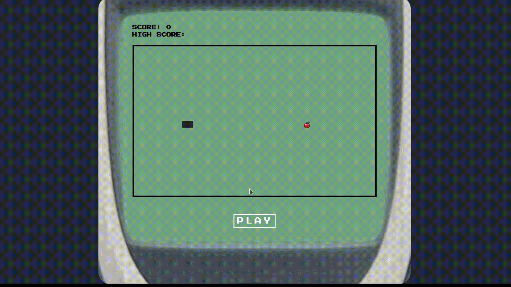

<h1 align="center">
   Snake-Game
</h1>

 

## :camera: Demonstração

## :rocket: Tecnologias

Esse projeto foi desenvolvido com as seguintes tecnologias:

✔️Typescript

✔️React

✔️React Hooks

✔️SASS

## 💻 Projeto

Snake Game (famoso jogo da cobrinha), tendo uma de suas primeiras versões em 1976, mas que ficou bastante popular no fim da década de 90 com os celulares da nokia. O jogo tem por objetivo coletar algumas maçãs espalhadas pelo cenário que vão proporcionalmente aumentando a cauda da cobra, buscando sempre evitar a colisão com as paredes ou com a própria cauda.

## ⚙ Configuração

1- Para instalar as dependências:

> yarn

2- Para iniciar a aplicação digite o comando a seguir no terminal :

> yarn dev
